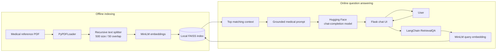

# RAG Medical Bot

> A retrieval-augmented medical question-answering application that grounds concise AI responses in a trusted reference document instead of relying only on a language model's memory.

> [!CAUTION]
> This project is an educational prototype. It does not provide medical advice, diagnosis, or treatment, and it should not be used as a substitute for a qualified healthcare professional.

## Problem Statement

Medical information is easy to find online, but it is often difficult to judge whether an answer is relevant, grounded, or simply generated with confidence. I wanted to build a small system where a user could ask a plain-language medical question and receive a concise response based on a specific reference source.

This matters because an ungrounded language model can produce plausible but unsupported medical claims. The goal of this project is not to replace a doctor. It is to explore how retrieval-augmented generation (RAG) can make an AI assistant more transparent and source-constrained by retrieving relevant passages before generating an answer.

## My Approach & Reasoning

I separated the system into two workflows: offline document indexing and online question answering.

During indexing, the application loads the medical encyclopedia PDF, divides it into overlapping chunks, converts those chunks into embeddings, and saves them in a local FAISS index. This work is performed once instead of every time a user asks a question.

During question answering, the same embedding model converts the user's question into a vector. FAISS retrieves the most relevant chunk, and that context is passed to a hosted language model through a constrained prompt.

I chose this design for several reasons:

- **RAG instead of model-only generation:** grounding the answer in retrieved text reduces dependence on the model's internal knowledge.
- **Separate ingestion and serving paths:** parsing and embedding hundreds of PDF pages is too expensive to repeat for every web request.
- **Recursive text splitting:** 500-character chunks with 50-character overlap provide small retrieval units while preserving some context across boundaries.
- **Local FAISS instead of a managed vector database:** FAISS is fast, simple, and inexpensive for a single-document prototype. A hosted vector database would add operational complexity without providing much value at this scale.
- **Compact retrieval (`k=1`):** one highly relevant chunk keeps prompts small and answers focused. The tradeoff is lower recall for questions whose answer spans multiple passages.
- **Hosted inference instead of running a 7B model locally:** this keeps local hardware requirements modest, although it introduces network availability, provider, and API compatibility dependencies.
- **A code-native Flask interface:** server-rendered HTML, custom CSS, and lightweight JavaScript provide a polished experience without adding a frontend framework or external asset dependency.

## AI Tools Used

I used **OpenAI Codex** as an engineering assistant during implementation, debugging, verification, and documentation.

Codex helped me:

- inspect the repository and trace failures across the PDF loader, embedding layer, FAISS store, retriever, and LLM client;
- reproduce runtime errors instead of guessing from the final exception message;
- identify missing dependencies and misleading exception handling;
- investigate Hugging Face task and client compatibility;
- run focused smoke tests and an end-to-end retrieval question;
- draft and validate this README against the working code.

I directed the work by providing the project context and real error output. I reviewed the proposed changes, kept the fixes scoped to the failing components, and verified the resulting pipeline with actual PDF ingestion, FAISS loading, and a live QA request. AI-generated suggestions were treated as hypotheses to test, not as automatically correct output.

No other AI development tools are claimed for this project.

## System Design Overview



The included reference document currently produces:

- **759 PDF pages**
- **7,080 text chunks**
- a persisted FAISS index in `vectorstore/db_faiss/`

The primary tradeoff is simplicity versus production robustness. Local persistence and a synchronous Flask application make the architecture easy to understand, but they do not yet provide multi-user scaling, background indexing, model failover, or formal medical-quality evaluation.

## Features

- **Grounded medical Q&A:** answers are generated from retrieved reference material rather than from an unconstrained prompt.
- **Concise responses:** the prompt asks for a focused answer in two to three lines.
- **Persistent semantic search:** the PDF is indexed once and reused across application runs.
- **Low-infrastructure local setup:** FAISS runs locally without a separate database service.
- **Responsive chat interface:** the single-column layout adapts cleanly across desktop and mobile screens.
- **Guided first question:** selectable prompt suggestions help users understand the intended scope of the assistant.
- **Improved chat experience:** users can review the conversation, clear the session, submit with the keyboard, and see retrieval feedback while a request is processing.
- **Restrained visual design:** the interface uses simple cards, clear spacing, and a small loading animation instead of decorative effects.
- **Safe response rendering:** user and model content is HTML-escaped before line breaks are added.
- **Configurable hosted model:** the Hugging Face model can be changed through an environment variable.
- **Operational logging:** ingestion, embedding, retrieval, model initialization, and failures are written to timestamped log files.
- **Fail-fast pipeline errors:** loader and chunking exceptions are propagated so the reported failure points to the actual broken stage.

## Frontend Experience

The interface is intentionally lightweight: one centered chat card containing
the introduction, conversation, suggested questions, composer, and medical-use
disclaimer. The layout remains single-column on every screen size so the
question-and-answer workflow stays prominent.

The frontend includes:

- a neutral light theme with restrained teal accents;
- code-native SVG and CSS with no remote image or font requests;
- a small typing indicator for retrieval feedback;
- suggested questions that populate the composer without immediately sending;
- an autosizing textarea with a 1,000-character counter;
- `Enter` to submit and `Shift+Enter` to insert a new line;
- disabled submission state and retrieval progress feedback;
- semantic landmarks, accessible labels, visible focus states, and reduced-motion support;
- dedicated empty, conversation, loading, and error states.

## Tech Stack & Why

| Technology | Role | Why I chose it |
| --- | --- | --- |
| Python 3.10 | Application language | Strong ecosystem for document processing, embeddings, vector search, and AI orchestration. |
| LangChain | RAG orchestration | Provides document abstractions, prompt templates, retrievers, and `RetrievalQA` integration. |
| PyPDF / `PyPDFLoader` | PDF extraction | Converts the source PDF into page-level LangChain documents with minimal custom parsing code. |
| Recursive text splitter | Chunking | Splits text at sensible boundaries while supporting overlap between chunks. |
| `sentence-transformers/all-MiniLM-L6-v2` | Embeddings | A compact, widely used 384-dimensional embedding model with a good speed-to-quality balance for local semantic search. |
| FAISS | Vector search | Fast local similarity search with no database server or cloud account required. |
| Hugging Face Inference API | Text generation | Avoids the compute and memory cost of serving an instruction model locally. |
| `Qwen/Qwen2.5-7B-Instruct` | Default answer model | Provides instruction-following chat completion through an available Hugging Face inference provider. |
| Flask and Jinja | Web application | Server rendering keeps the request flow simple while still supporting sessions, errors, and conversation state. |
| HTML5 and inline SVG | Interface structure and icons | Semantic markup and lightweight vector graphics avoid a separate icon or image dependency. |
| CSS3 | Responsive styling | Custom properties, a small responsive layout, and minimal motion provide a clear interface without a UI framework. |
| Vanilla JavaScript | Chat interactions | A small script handles prompt suggestions, textarea resizing, character counting, keyboard submission, and loading feedback. |
| `python-dotenv` | Configuration | Keeps tokens and environment-specific model settings out of source code. |
| Python logging | Diagnostics | Preserves stage-by-stage evidence when ingestion or inference fails. |

## Challenges & How I Solved Them

### 1. A missing PDF dependency looked like a vector-store failure

`PyPDFLoader` could not import `pypdf`, but the loader caught the exception and returned an empty list. Empty documents became empty chunks, which eventually caused FAISS to report `No text chunks were provided`.

I installed the missing dependency and changed the loader functions to re-raise failures. The pipeline now stops at the real source of the problem instead of producing a misleading downstream error.

### 2. Debug code introduced an unrelated LangChain error

An accidental `langchain.text_splitter` module import and call produced an attribute error that obscured the document-loading problem. I removed the unused import and kept text splitting inside the dedicated PDF component.

### 3. The original Hugging Face wrapper rejected the model task

The older `HuggingFaceHub` integration attempted to infer a task and received `None`, causing validation to fail. Explicitly setting `text-generation` was not a complete fix because the configured Mistral model was exposed by its provider as a conversational model.

### 4. The LangChain and Hugging Face clients had drifted apart

The installed LangChain wrapper called `InferenceClient.post()`, a method no longer available in the installed Hugging Face client. I replaced that integration with a small LangChain-compatible LLM adapter that calls `InferenceClient.chat_completion()`.

### 5. The configured model provider was unhealthy

The original Mistral provider mapping was reporting an error. I tested current provider mappings and verified a live request before changing the default to `Qwen/Qwen2.5-7B-Instruct`.

### 6. Environment loading depended on import order

The application imported configuration before loading `.env`, so tokens could be missing depending on how the process was started. Configuration now loads the project-level `.env` before reading token and model settings.

## What I'd Do Differently

If I continued this project, I would:

- pin and lock a tested dependency set to prevent future LangChain and Hugging Face API drift;
- rename `retreiver.py` to `retriever.py` and standardize naming such as `create_text_chunks`;
- initialize and cache the embedding model, vector store, and QA chain once instead of rebuilding them for every submitted question;
- retrieve multiple chunks and add reranking for questions whose answer spans several sections;
- return source page metadata with each answer so users can inspect the supporting passage;
- add an explicit abstention path when retrieval confidence is low;
- build an evaluation set measuring retrieval recall, answer faithfulness, latency, and unsupported medical claims;
- add unit, integration, and browser tests;
- move the Flask secret key into environment configuration and use production-grade session storage;
- run behind a production WSGI server with rate limiting, request timeouts, and structured monitoring;
- support document upload, background re-indexing, and multiple corpora;
- verify corpus licensing and establish a clearer content-governance process before public deployment.

## Setup & Usage

You can run the project in a Docker container or directly with Python. Docker is
the recommended option when you want the same environment across macOS, Windows,
and Linux.

### Option A: Run with Docker

#### Docker prerequisites

- Docker Desktop or Docker Engine configured to run Linux containers
- A Hugging Face account and access token
- Internet access for the image build, the initial embedding-model download,
  and hosted LLM requests

The image uses Docker's multi-architecture Python base image and can be built
natively on common `linux/amd64` and `linux/arm64` hosts. This covers Intel/AMD
computers, Apple Silicon machines, and Windows systems running Linux containers.

#### 1. Clone and configure the project

```bash
git clone <your-repository-url>
cd "RAG Medical Bot"
cp .env.example .env
```

On Windows PowerShell, copy the environment file with:

```powershell
Copy-Item .env.example .env
```

Open `.env` and add your Hugging Face token:

```dotenv
HF_TOKEN=hf_your_token_here
HUGGINGFACE_REPO_ID=Qwen/Qwen2.5-7B-Instruct
```

`HUGGINGFACE_REPO_ID` is optional, and `HUGGINGFACEHUB_API_TOKEN` may be used
instead of `HF_TOKEN`. Never commit the populated `.env` file.

#### 2. Build the image

```bash
docker build -t rag-medical-bot .
```

The Docker build:

- selects the appropriate base image for the host CPU architecture;
- installs the Python and FAISS runtime dependencies;
- includes the application, reference document, and existing FAISS index;
- excludes local virtual environments, logs, Git metadata, and `.env`;
- creates a non-root runtime user.

The first build can take several minutes because the machine-learning
dependencies are comparatively large. Later builds reuse Docker's cached
dependency layer when `requirements.txt` has not changed.

#### 3. Start the container

```bash
docker run --rm --name rag-medical-bot \
  --env-file .env \
  -p 5050:5050 \
  rag-medical-bot
```

Open [http://localhost:5050](http://localhost:5050).

For PowerShell, the same command can be entered on one line:

```powershell
docker run --rm --name rag-medical-bot --env-file .env -p 5050:5050 rag-medical-bot
```

The host port can be changed without rebuilding the image. For example, this
serves the application at `http://localhost:8080`:

```bash
docker run --rm --env-file .env -p 8080:5050 rag-medical-bot
```

The internal port is also configurable for platforms that inject a `PORT`
environment variable:

```bash
docker run --rm --env-file .env -e PORT=8080 -p 8080:8080 rag-medical-bot
```

#### 4. Optional: persist cache and logs

Containers are disposable by default. Named volumes retain the downloaded
embedding model and application logs between container runs:

```bash
docker volume create rag-model-cache
docker volume create rag-logs

docker run --rm --name rag-medical-bot \
  --env-file .env \
  -p 5050:5050 \
  -v rag-model-cache:/app/.cache \
  -v rag-logs:/app/logs \
  rag-medical-bot
```

#### Build a multi-platform image for distribution

A normal `docker build` targets the current machine. To publish one image tag
that supports both AMD64 and ARM64 Linux hosts, use a buildx builder and push
the result to a container registry:

```bash
docker buildx build \
  --platform linux/amd64,linux/arm64 \
  -t <registry-user>/rag-medical-bot:latest \
  --push .
```

Replace `<registry-user>` with your Docker Hub or other registry namespace.

#### Docker troubleshooting

- **Docker daemon connection error:** start Docker Desktop or the Docker Engine,
  then retry the build.
- **Port already allocated:** map a different host port, such as
  `-p 8080:5050`.
- **Missing token:** confirm `.env` contains `HF_TOKEN` and that
  `--env-file .env` is present in the run command.
- **Model download or inference failure:** confirm the container has internet
  access and the Hugging Face token can access the configured model.
- **FAISS index missing:** build the index locally, then rebuild the image so
  `vectorstore/db_faiss/` is copied into it.
- **Apple Silicon deployment to an AMD64-only host:** either build on the target
  machine or publish the multi-platform image shown above.

### Option B: Run directly with Python

#### Python prerequisites

- Python **3.10**
- A Hugging Face account and access token
- Internet access for the initial embedding-model download and hosted LLM requests

#### 1. Clone the repository

```bash
git clone <your-repository-url>
cd "RAG Medical Bot"
```

#### 2. Create and activate a local Python environment

On macOS/Linux with Miniforge, Conda, or Mamba, create a project-local
environment:

```bash
mamba create -y -p "$(pwd)/.venv" python=3.10 pip
```

Use `conda create` with the same arguments if `mamba` is not installed.

If the `.venv` environment already exists, skip the create command and activate
it directly:

```bash
source /opt/miniforge3/bin/activate "$(pwd)/.venv"
```

This project environment is a Conda/Mamba prefix, so `.venv/bin/activate` may
not exist. Use Conda's activation script instead. If Miniforge is installed in a
different location, initialize Conda for the current shell and activate the
prefix:

```bash
eval "$(conda shell.zsh hook)"
conda activate "$(pwd)/.venv"
```

Replace `zsh` with `bash` if you use Bash.

Avoid installing dependencies into the Miniforge base environment. If Conda or
Mamba reports permission errors for its package cache, create the environment
with a project-local cache:

```bash
CONDA_PKGS_DIRS="$(pwd)/.conda-pkgs" mamba create -y -p "$(pwd)/.venv" python=3.10 pip
```

On Windows:

```powershell
py -3.10 -m venv .venv
.venv\Scripts\activate
```

#### 3. Install dependencies

```bash
python -m pip install --upgrade pip
python -m pip install -r requirements.txt
```

The requirements file pins the dependency versions used to verify PDF ingestion,
FAISS persistence, retrieval, and Hugging Face inference.

#### 4. Configure environment variables

Copy the example file:

```bash
cp .env.example .env
```

Add your Hugging Face token:

```dotenv
HF_TOKEN=hf_your_token_here
```

You may also override the answer model:

```dotenv
HUGGINGFACE_REPO_ID=Qwen/Qwen2.5-7B-Instruct
```

`HUGGINGFACEHUB_API_TOKEN` is accepted as an alternative to `HF_TOKEN`.

Never commit the populated `.env` file.

#### 5. Add or verify the source document

The default configuration expects:

```text
data/The_GALE_ENCYCLOPEDIA_of_MEDICINE_SECOND.pdf
```

If you use a different document, update `DATA_PATH` in `app/config/config.py`. Make sure you have permission to use and distribute the source material.

#### 6. Build the FAISS index

```bash
python -m app.components.data_loader
```

Successful ingestion creates:

```text
vectorstore/db_faiss/index.faiss
vectorstore/db_faiss/index.pkl
```

Re-run this command whenever the source document or embedding configuration changes.

#### 7. Start the web application

```bash
python -m app.application
```

Open [http://127.0.0.1:5050](http://127.0.0.1:5050) in a browser.

#### 8. Ask a question

Enter a medical question in the chat form. The application will:

1. embed the question;
2. retrieve the closest chunk from FAISS;
3. add that chunk to the prompt;
4. request an answer from the configured Hugging Face model;
5. display the concise response in the chat session.

You can also select one of the suggested questions to populate the composer.
Press `Enter` to submit or `Shift+Enter` to add another line.

## Project Structure

```text
.
├── app/
│   ├── application.py          # Flask routes and chat session handling
│   ├── common/                 # Logging and custom exception helpers
│   ├── components/
│   │   ├── data_loader.py      # End-to-end ingestion entry point
│   │   ├── pdf_loader.py       # PDF loading and text chunking
│   │   ├── embeddings.py       # Sentence Transformer initialization
│   │   ├── vector_store.py     # FAISS creation and loading
│   │   ├── retreiver.py        # RetrievalQA chain and prompt
│   │   └── llm.py              # Hugging Face chat-completion adapter
│   ├── config/config.py        # Paths, model ID, and chunk settings
│   ├── static/
│   │   ├── css/styles.css      # Lightweight responsive interface
│   │   └── js/app.js           # Composer and loading interactions
│   └── templates/index.html    # Accessible chat interface and UI states
├── data/                       # Reference document
├── vectorstore/db_faiss/       # Persisted vector index
├── logs/                       # Runtime logs
├── Dockerfile                  # Portable container build and runtime definition
├── .dockerignore               # Excludes secrets and host-specific build files
├── .env.example
├── requirements.txt
└── setup.py
```

## Interface Verification

The frontend was checked in rendered browser sessions at:

- **1280 × 720:** the desktop workspace, all suggestions, and composer fit
  without page-level scrolling;
- **390 × 844:** the mobile layout has no horizontal overflow and keeps the
  complete chat workflow within the viewport.

The verification also covered:

- Flask route and static asset responses;
- JavaScript syntax and browser console errors;
- suggested-question population and textarea resizing;
- hidden and visible loading states;
- conversation and error-state rendering;
- HTML escaping for submitted and generated messages;
- balanced responsive layouts with and without reduced motion.

## Known Limitations

- Responses can still be incomplete or incorrect even when context is retrieved.
- Only one retrieved chunk is currently supplied to the model.
- The application does not show citations or retrieval confidence.
- The hosted model requires a working external provider and network connection.
- The QA chain is currently initialized per request, increasing response latency.
- Responses arrive after the complete server request rather than streaming token
  by token; the retrieval animation communicates progress in the meantime.
- The responsive interface has been manually verified at representative desktop
  and mobile sizes, but it does not yet have automated visual-regression tests.
- Flask's built-in server is intended for development, not production.
- The Docker image also uses Flask's built-in server and should be placed behind
  a production WSGI server or reverse proxy before public deployment.
- The image bundles the current PDF and FAISS index at build time; changes to
  either require rebuilding the image or mounting replacement files.
- The current corpus is a fixed reference document and may not reflect current clinical guidance.

## License

No project license has been specified yet. The source document may have separate copyright and usage restrictions.
